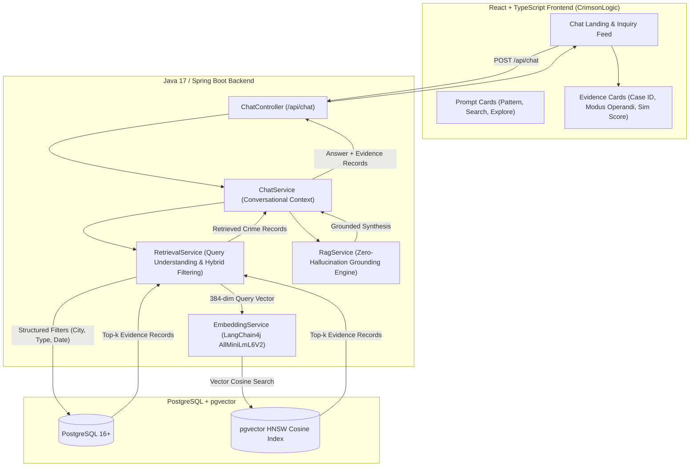

# CrimsonLogic — Intelligent Conversational AI for Crime Database

An evidence-grounded conversational AI intelligence assistant for querying synthetic crime database records using natural language. Built with a robust **Java 17 Spring Boot** backend leveraging **LangChain4j**, **Spring Data JPA**, and **PostgreSQL with pgvector**, paired with a **React + TypeScript + Vite** CrimsonLogic intelligence interface.

> [!NOTE]
> **Academic & Synthetic Demo Notice**: The crime records used by this prototype are synthetic data generated solely for demonstration and academic purposes. All cases, descriptions, IDs, dates, and locations are fictional.

---

## 1. Project Overview

CrimsonLogic is a conversational intelligence assistant that enables investigators, analysts, and academic researchers to query structured and unstructured crime database records using plain English. Users do not need to write complex SQL queries or understand schema structures. The system autonomously parses structured filters (city, crime category, date, case status, severity, age), performs dense vector similarity search using `pgvector`, and grounds LLM synthesis strictly on retrieved evidence records to prevent hallucinations.

---

## 2. Problem Statement & Solution

### Problem Statement
Traditional crime database interfaces require rigid SQL queries, manual multi-table joins, or keyword searches that fail when investigators describe incidents with variable vocabulary (e.g., "stolen smartphone" vs "handset snatched on a train"). Furthermore, standard generative AI systems suffer from hallucinations when queried about sensitive factual records.

### Solution
CrimsonLogic bridges natural-language queries with PostgreSQL through a **Hybrid RAG Pipeline**:
1. **Query Entity & Filter Extraction**: Detects structured criteria (e.g., `City: Chennai`, `Year: 2026`, `Status: Open`).
2. **Dense Semantic Retrieval**: Computes 384-dimensional cosine similarity embeddings across textual incident descriptions via `pgvector`.
3. **Evidence-Grounded Synthesis**: LangChain4j feeds only the retrieved database records into the LLM context, ensuring all statements are verified by database evidence.

---

## 3. System Architecture



---

## 4. Technology Stack

### Backend
- **Java 17**
- **Spring Boot 3.3.4** (Spring Web, Spring Data JPA, Spring Validation)
- **LangChain4j 0.35.0** (OpenAI LLM Integration, In-process AllMiniLmL6V2 Embeddings)
- **PostgreSQL 16+ & pgvector** (Dense vector storage and indexing)
- **Hibernate / JPA**
- **Maven** (with `mvnw` wrapper included)
- **JUnit 5 & Mockito**

### Frontend
- **React 18**
- **TypeScript**
- **Vite 5**
- **Lucide React Icons**
- **Vanilla CSS / Custom Crimson Design System**

---

## 5. RAG Pipeline

```
User Query
    ↓
Query Understanding (City, Crime Type, Year, Status extraction)
    ↓
Embedding Generation (AllMiniLmL6V2 384-dim vector)
    ↓
PostgreSQL + pgvector Similarity Search
    ↓
Top Relevant Crime Records
    ↓
Context Construction & Prompt Template
    ↓
LangChain4j LLM Execution
    ↓
Structured Answer + Supporting Evidence Cards
```

---

## 6. Database Schema

```sql
CREATE EXTENSION IF NOT EXISTS vector;

CREATE TABLE crime_records (
    id BIGSERIAL PRIMARY KEY,
    case_id VARCHAR(50) UNIQUE NOT NULL,
    crime_type VARCHAR(100) NOT NULL,
    location VARCHAR(100) NOT NULL,
    incident_date DATE NOT NULL,
    description TEXT NOT NULL,
    victim_age INT,
    suspect_age INT,
    status VARCHAR(50) NOT NULL,
    severity VARCHAR(20) NOT NULL DEFAULT 'Medium',
    created_at TIMESTAMP WITH TIME ZONE DEFAULT CURRENT_TIMESTAMP,
    embedding vector(384)
);

CREATE INDEX idx_crime_records_type ON crime_records(crime_type);
CREATE INDEX idx_crime_records_location ON crime_records(location);
CREATE INDEX idx_crime_records_embedding_hnsw 
ON crime_records USING hnsw (embedding vector_cosine_ops);
```

---

## 7. Synthetic Mock Dataset

The application includes over 100 realistic synthetic crime records seeded across 10 major jurisdictions:
- **Cities**: Chennai, Mumbai, Delhi, Bengaluru, Hyderabad, Kolkata, Pune, Kochi, Coimbatore, Madurai
- **Categories**: Theft, Robbery, Burglary, Assault, Cybercrime, Fraud, Vehicle Theft, Mobile Phone Theft, Missing Person, Vandalism, Drug-related offences
- **Semantic Variation**: Rich natural language descriptions designed to test semantic vector matching (e.g., *"handset was taken while boarding a train"*, *"smartphone disappeared from a commuter's bag"*).

---

## 8. Setup & Execution Instructions

### Prerequisites
- **Java 17+** (`java -version`)
- **Node.js 18+** & `npm` (`node -v`)
- **PostgreSQL with pgvector** (or embedded fallback)

### Environment Variables
Configure `.env` in `backend/` or set system environment variables:
```bash
DATABASE_URL=jdbc:postgresql://localhost:5432/crime_database
DATABASE_USERNAME=postgres
DATABASE_PASSWORD=postgres
LLM_API_KEY=your_openai_api_key_here
LLM_MODEL_NAME=gpt-4o-mini
PORT=8080
```

### Running Backend (Spring Boot)
```cmd
cd backend
mvnw.cmd spring-boot:run
```
*(On Linux/macOS: `./mvnw spring-boot:run`)*

### Running Frontend (React + Vite)
```cmd
cd frontend
npm install
npm run dev
```

Visit **http://localhost:5173** in your browser.

---

## 9. Example Test Queries

1. *"Show theft cases in Chennai."*
2. *"Find robbery cases in Mumbai."*
3. *"Show unresolved cases in Bengaluru."*
4. *"Find cybercrime cases during 2026."*
5. *"Show high severity cases in Delhi."*
6. *"Find mobile phone theft cases involving victims below 25."*
7. *"Show cases similar to a phone stolen from a railway passenger."*
8. *"Which cases are still under investigation?"*

---

## 10. API Specification

### `POST /api/chat`
**Request**:
```json
{
  "message": "Show theft cases in Chennai",
  "sessionId": "session-101"
}
```

**Response**:
```json
{
  "answer": "I found 5 theft cases in Chennai.",
  "evidence": [
    {
      "caseId": "CASE-1001",
      "crimeType": "Mobile Phone Theft",
      "location": "Chennai",
      "date": "2026-05-14",
      "status": "Open",
      "severity": "Medium",
      "description": "A mobile phone was reported stolen from a commuter while travelling through a crowded railway station.",
      "similarityScore": 0.892
    }
  ],
  "totalFound": 5,
  "sessionId": "session-101"
}
```

---

## 11. Automated Testing

Run the test suite using Maven:
```cmd
cd backend
mvnw.cmd test
```

Tests cover:
- `ChatControllerTest`: HTTP endpoint contracts and validation.
- `RetrievalServiceTest`: Query decomposition and semantic vector ranking.
- `ChatServiceTest`: Conversational context and grounding.
- `CrimeRecordRepositoryTest`: JPA and vector query assertions.

---

## 12. Limitations & Future Scope

- **Spatial Coordinate Mapping**: Extend city-level matching with PostGIS polygon boundary queries.
- **Multimodal Records**: Ingest forensic report attachments and CCTV timestamps.
- **Advanced Query Federation**: Multi-jurisdiction cross-database routing.

> **Disclaimer**: CrimsonLogic is an academic PBL prototype. All records in this application are synthetic demonstration data and do not represent real people or real crime cases.
