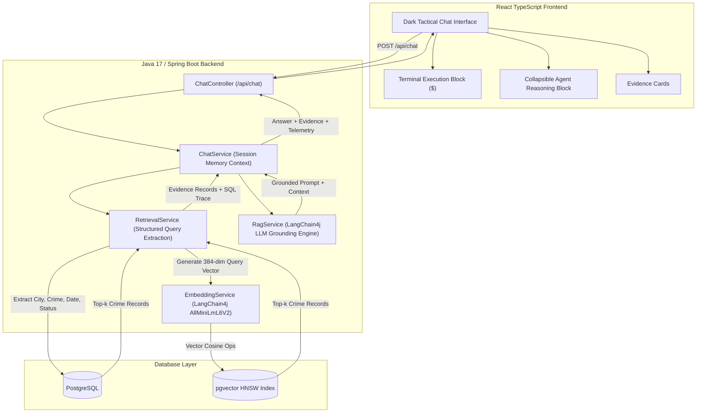

# Intelligent Conversational AI for Crime Database

An enterprise-grade, evidence-grounded conversational AI assistant designed for querying criminal records using natural language. Built with a robust **Java 17 Spring Boot** backend leveraging **LangChain4j**, **Spring Data JPA**, and **PostgreSQL with pgvector**, coupled with a **React + TypeScript + Vite** dark-mode tactical investigation interface.

> [!NOTE]
> **Synthetic Demo Data**: All crime records shown are entirely fictional and generated strictly for demonstration and testing purposes.

---

## Architecture Diagram



---

## Features

- **Natural Language Querying**: Users ask plain English questions without needing SQL knowledge.
- **Hybrid Retrieval**: Extracts structured constraints (City, Crime Type, Status, Year, Age) combined with dense vector semantic search.
- **LangChain4j RAG Pipeline**: Enforces zero hallucination by strictly conditioning answers on retrieved PostgreSQL records.
- **pgvector Vector Search**: Dense 384-dimensional vector similarity ranking with cosine distance.
- **Transparent Evidence Backing**: Every AI response displays matching database records with Case IDs, timestamps, severity badges, and similarity scores.
- **Multi-turn Conversational Context**: Supports contextual follow-up questions (e.g., *"Show theft in Mumbai"* followed by *"Which of them are still open?"*).
- **Dark AI Agent Interface**: Built to specification using layered grayscale palette (`#0f1115`, `#181b21`, `#232730`), Inter + JetBrains Mono fonts, collapsible technical blocks, and radar-pulse status indicator.
- **Synthetic Demo Dataset**: Includes 105 realistic fictional records across 10 Indian cities.

---

## Technology Stack

### Backend
- **Java 17**
- **Spring Boot 3.3.4** (Spring Web, Spring Data JPA, Spring Validation)
- **LangChain4j 0.35.0** (OpenAI, In-process AllMiniLmL6V2 Embedding Model)
- **PostgreSQL 16+ & pgvector** (with H2 embedded fallback for zero-setup execution)
- **Maven** (with `mvnw` wrapper included)
- **JUnit 5 & Mockito**

### Frontend
- **React 18**
- **TypeScript**
- **Vite 5**
- **Lucide React Icons**
- **Vanilla CSS / Custom Design Tokens**

---

## Database Schema

```sql
CREATE EXTENSION IF NOT EXISTS vector;

CREATE TABLE crime_records (
    id BIGSERIAL PRIMARY KEY,
    case_id VARCHAR(50) UNIQUE NOT NULL,
    crime_type VARCHAR(100) NOT NULL,
    location VARCHAR(100) NOT NULL,
    incident_date DATE NOT NULL,
    description TEXT NOT NULL,
    victim_age INT,
    suspect_age INT,
    status VARCHAR(50) NOT NULL,
    severity VARCHAR(20) NOT NULL DEFAULT 'Medium',
    created_at TIMESTAMP WITH TIME ZONE DEFAULT CURRENT_TIMESTAMP,
    embedding vector(384)
);

CREATE INDEX idx_crime_records_type ON crime_records(crime_type);
CREATE INDEX idx_crime_records_location ON crime_records(location);
CREATE INDEX idx_crime_records_embedding_hnsw 
ON crime_records USING hnsw (embedding vector_cosine_ops);
```

---

## Setup & Execution

### 1. Prerequisites
- **Java 17+** installed (`java -version`)
- **Node.js 18+** & `npm` installed (`node -v`)
- *(Optional)* PostgreSQL with pgvector extension enabled. If PostgreSQL is not running, the application automatically runs in zero-configuration mode using embedded storage!

### 2. Environment Variables
Copy `.env.example` to `.env` in `backend/` or configure environment variables:
```bash
# PostgreSQL Database (Optional - falls back to in-memory mode if omitted)
DATABASE_URL=jdbc:postgresql://localhost:5432/crime_database
DATABASE_USERNAME=postgres
DATABASE_PASSWORD=postgres

# LangChain4j LLM API Key (Optional - uses local grounded synthesis engine if omitted)
LLM_API_KEY=your_openai_api_key_here
LLM_MODEL_NAME=gpt-4o-mini
PORT=8080
```

### 3. Running the Backend (Spring Boot)
Navigate to the `backend/` folder and start the application:

**Windows**:
```cmd
cd backend
mvnw.cmd spring-boot:run
```

**Linux / macOS**:
```bash
cd backend
./mvnw spring-boot:run
```

The backend starts at `http://localhost:8080` and automatically populates the 105 synthetic crime records and indexes their vector embeddings.

### 4. Running the Frontend (React + Vite)
In a separate terminal, navigate to `frontend/`:
```bash
cd frontend
npm install
npm run dev
```

Open `http://localhost:5173` in your web browser.

---

## Example Test Queries

The application comes pre-loaded with mock data to test these natural language scenarios:

1. **Structured City + Crime Type Search**:
   > *"Show theft cases in Chennai."*
2. **Cybercrime & Fraud**:
   > *"Find cybercrime cases in Bengaluru."*
3. **Unresolved / Status Queries**:
   > *"Show unresolved cases in Mumbai."*
4. **Demographic Queries**:
   > *"Find mobile phone theft cases involving young victims."*
5. **Year Filtering**:
   > *"Show robbery cases reported during 2026."*
6. **Pure Semantic Search** (matching concepts without exact keywords):
   > *"Find cases similar to a mobile phone being stolen from a railway passenger."*
7. **Conversational Context Follow-up**:
   - Turn 1: *"Show theft cases in Mumbai."*
   - Turn 2: *"Which of them are still open?"*

---

## REST API Specification

### `POST /api/chat`
**Request**:
```json
{
  "message": "Show theft cases in Mumbai",
  "sessionId": "session-123"
}
```

**Response**:
```json
{
  "answer": "I found 4 theft cases in Mumbai matching your query. The verified case records are displayed as evidence below.",
  "evidence": [
    {
      "caseId": "CASE-1005",
      "crimeType": "Theft",
      "location": "Mumbai",
      "date": "2026-06-12",
      "status": "Open",
      "severity": "Low",
      "description": "A backpack containing a work laptop, wallet, and personal documents was taken from an office lobby.",
      "victimAge": 29,
      "suspectAge": null,
      "similarityScore": 0.842
    }
  ],
  "reasoning": [
    {
      "stepName": "Query Analysis & Filter Extraction",
      "description": "Parsed natural language query for entity constraints and intent.",
      "details": "Location: Mumbai | CrimeType: Theft | Status: ANY"
    }
  ],
  "terminalLog": "$ [SQL-PLAN] SELECT * FROM crime_records WHERE location = 'Mumbai' AND crime_type ILIKE '%Theft%';\n$ [RESULT] SUCCESS: Top 4 evidence records assembled in 14ms.",
  "totalFound": 4,
  "sessionId": "session-123"
}
```

---

## Automated Tests

Run backend unit and integration test suite:
```cmd
cd backend
mvnw.cmd test
```

Tests include:
- `ChatControllerTest`: WebMvc endpoint validation and error handling.
- `RetrievalServiceTest`: Semantic ranking and entity parsing.
- `ChatServiceTest`: Conversational context management.
- `CrimeRecordRepositoryTest`: Data JPA query assertions.

---

## Limitations & Future Scope

- **Real-time Geofencing**: Current spatial search matches cities; future versions could integrate PostGIS bounding box distance calculations.
- **Multi-modal Evidence**: Support attaching audio/video evidence links and forensic report summaries.
- **Role-based Access Control (RBAC)**: Secure multi-department access levels for law enforcement agencies.
